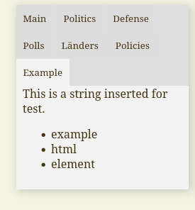

# How to add a tab to the status bar on the left
First, add a button element inside this div in index.html:
```html
                <div id='stats_sidebar' class='tools left'>
                    <div class="tab_container">
                      <!-- HERE -->
                    </div>
                    <div id="qualities">
                    </div>
                </div>
```
A correct element example is this:
```html
<button class="tab_button" id="example_tab" onclick="window.changeTab('status.example', 'example_tab');">Example</button>
```

Then, you need to create a (sub)scene with the proper elements in status.scene.dry.
The scene should have the same name with the one you inputted at window.changeTab. In our case,
it's "example":

```html
@example

This is a string inserted for test.

{!
  <ul>
    <li>example</li>
    <li>html</li>
    <li>element</li>
  </ul>   
    
!}
```
Here's the resulting tab:

